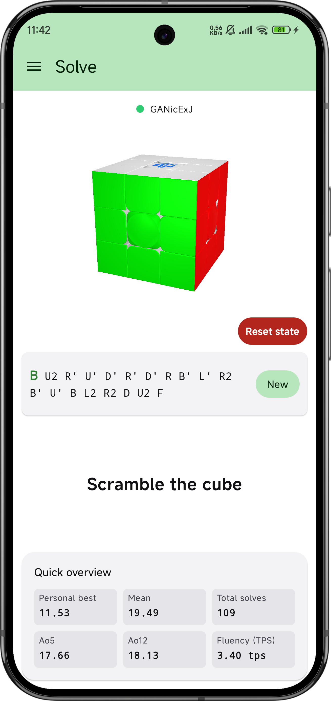
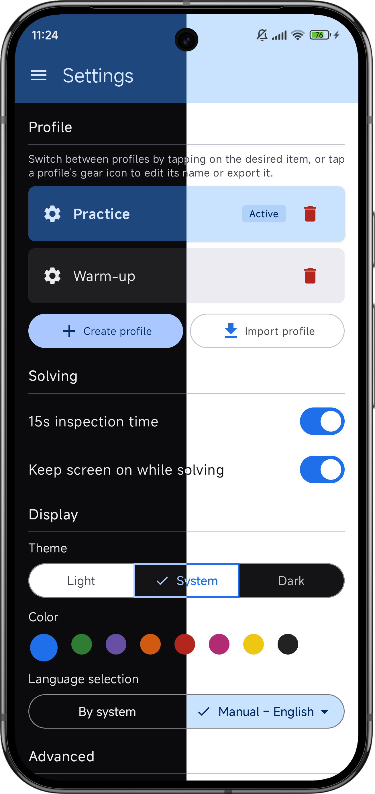
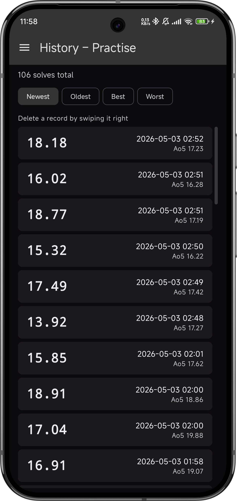

<!--
  This README is read on both Codeberg (canonical for source, issues,
  and PRs) and GitHub (mirror, plus the build host that produces the
  release APKs). The banner below is true on both forges; on Codeberg
  it explains where binaries come from, on GitHub it explains why
  issues and PRs aren't accepted there.
-->

> **Canonical source: [codeberg.org/zucham/QBSmarter](https://codeberg.org/zucham/QBSmarter).**
> Issues and pull requests live there. The
> [GitHub mirror](https://github.com/zucham/QBSmarter) is a one-way clone
> that builds the release APKs (Codeberg's hosted CI is too resource-limited
> for an Android Gradle build). Issues are disabled on the GitHub side; PRs
> cannot be merged there. **Source and discussion go to Codeberg, signed APKs
> are downloaded from GitHub Releases.**


<div align="center">


# QBSmarter

Pronounced *"cube smarter" &ndash;* nothing fancy or complicated.

</div>

QBSmarter is an **Android-first companion app for Bluetooth-enabled smart
cubes**, written in Kotlin with Compose Multiplatform.

It connects to your cube over BLE and renders a real-time 3D visualization
of your cube including face moves and gyro rotations. It also generates scrambles,
times your solves, and keeps a per-profile history of them with useful statistics included.

<div align="center">

**Here are some screenshots:**

</div>

<table style="width:auto">
  <tr>
    <td></td>
    <td></td>
    <td></td>
  </tr>
</table>

>More screenshots with descriptions are located [here](assets/Markdown/SCREENSHOTS.md).

QBSmarter is build on Material 3, which allows it to look beautiful everywhere.
You can choose between 8 different color accents, as well as pick the overall theme. The app
supports both dark mode and light mode, though it follows your system's theme preference
by default.

> Note: the minimum supported version of Android required to use QBSmarter is **Android 10** (API 29).

<div align="center">

### Download the latest released APK from GitHub:

[](https://github.com/zucham/QBSmarter/releases/latest)

</div>

---

## Table of contents

1. [Motivation](#motivation)
2. [Main goals](#main-goals)
3. [Roadmap](#roadmap)
4. [Main technologies](#main-technologies)
5. [Pros and cons](#pros-and-cons)
6. [Tooling, installation, and how to build it yourself](#tooling-installation-and-how-to-build-it-yourself)
7. [Dependencies](#dependencies)
8. [Project documentation](#project-documentation)
9. [Issue tracker and contact](#issue-tracker-and-contact)
10. [FAQ](#faq)
11. [Contributing](#contributing)
12. [AI-assisted development](#ai-assisted-development)
13. [License and warranty](#license-and-warranty)
14. [Acknowledgements](#acknowledgements)

---

## Motivation

I loved the idea of smart cubes since they first appeared. After seeing the promotional
videos for the first GAN smart cube, I wanted to buy one badly. It was too expensive,
but a few year down the line I bought the cheaper GAN356 i Carry. I was impressed
by the hardware quality considering its price, but the official app left me severely disappointed.

Not only does it require you to create an account to even use it, it also didn't work
too well in the past. Nowadays, it's usable, but you still need to login every time to use it
and you need to keep your internet connection active the whole time while using it.

This was a problem for me, and not just a practical one &ndash; I hated this approach 
for it was taking away freedom of choise from me. I wanted to keep using the cube,
so I looked for alternatives.

Some time later, csTimer added support for these cubes via Web Bluetooth API - it
required the user to obtain the cube's MAC address first to be usable, but otherwise
this was an upgrade. It didn't work on phones very well, which it now does to some degree,
but I still longed for a native Android alternative.

To cut to the chase, I am currently finishing up my bachelor's degree in CS and
I have picked up this project as my bachelor's thesis - to create an alternative
Android-first app for speedcubers like me, who want to simply use their smart cubes
to train and solve, nothing else. It has many bugs and few features, but I hope to change
that over time.

One thing is sure though &ndash; QBSmarter will stay free forever, with as many
useful functions and as few annoyances as possible.

---

## Main goals

I had to speed up development to make deadlines for my bachelor's thesis, and I am mostly happy
with how this app has turned out. It supports everything needed for long solving sessions
and comfort of use, but there are many areas in which it lacks.

Here is a quick, priority-sorted list of future goals and features:

- **Wider hardware support**. Currently, only certain GAN cubes are supported.
I want to expand to as many vendors/models as possible.
If your model is supported by csTimer and you want to speed up its adoption to QBSmarter,
please do contant me if you can help with testing.
- **Fully WCA-compliant scrambles**. Currently, the app does not follow the official methods to reach
a scramble. The plan is to use a full Kociemba two-phase solver for this, like csTimer's `min2solve`.
- **More statistics**. Only basic statistics are available now. The plan is to record every move along
with its timestamp. This will allow the app to analyze parts of the solve like the cross, F2L, OLL and PLL
separately and in more detail.
- **csTimer compatible data import/export**: Many people use csTimer as their primary cubing app, and store
their solves there. A way to import these solves to QBSmarter for analysis easily would surely be useful.
- **Various QoL features**. Most of this will probably arise from testing, but I already have a few
improvements in mind. Renaming cubes, filtering solve history by date and time, customising color accents,
toggleable sound effects, per-brand 3D cube model, improved 3D visuals quality an many others. Feel free to let me know if you want to see
your idea in the next version, I am open to cooperate.
- **Server**. A server/client architecture might bring some interesting ideas to the table. Solving battles
on a local WiFi or through a central server are the biggest use case I see. Big potential, lots of work.


---

## Roadmap for multiplatform support

QBSmarter is built in Compose Multiplatform, but it currently only supports Android (as of release 1.0.0).
Other platforms have some obstacles:

- **JVM - Desktop.** Already a build target with a placeholder window.
  Would need real `BleManager`, `DriverFactory`, and crypto actuals (BlueZ on
  Linux, BluetoothLE Advertisement Watcher on Windows; `JdbcSqliteDriver`
  for persistence). Very doable, will just need some work.
- **Web (JS / WASM).** Targets exist but are excluded from `settings.gradle.kts`
  because korender's web variant doesn't currently work for our use case.
  For now, people can use other web-based alternatives.
- **iOS.** Blocked on Korender adding an iOS variant, or by me implementing all the code and contributing
  to Korender myself. I don't own an iPhone or a Mac, so iOS development is a problem for now.
  Without the money and equipment needed, I don't see myself doing it any time soon.

---

## Main technologies

- **Kotlin 2.3.10** with the multiplatform plugin.
- **Compose Multiplatform 1.10.1** &ndash; one composition tree, all the screens.
- **Material 3 1.10.0-alpha05** &ndash; Material You theming.
- **korender 0.6.1** &ndash; the 3D engine that renders the cube view.
- **kotlinx.coroutines 1.10.2** &ndash; `StateFlow`, `SharedFlow`, structured
  concurrency.
- **Koin 4.1.1** &ndash; dependency injection, started in `Application.onCreate`.
- **SQLDelight 2.2.1** &ndash; type-safe SQLite for solves, profiles, settings.
- **AndroidX Navigation Compose 2.9.0-alpha14** (multiplatform variant) &ndash;
  single `NavHost` rooted in `AppScaffold`.
- **AndroidX Lifecycle ViewModel Compose 2.9.6** &ndash; multiplatform
  ViewModels.
- **kotlinx-serialization-json 1.9.0** &ndash; profile import/export envelope.
- **kotlinx-datetime 0.7.1** &ndash; local-time formatting.
- **Kermit 2.1.0** &ndash; tagged loggers per class. R8 strips
  `.d`/`.v`/`.i` calls in release builds.
- **multiplatform-markdown-renderer 0.39.2** &ndash; the in-app usage guide is
  rendered from bundled localised Markdown files.

For an authoritative breakdown including the rationale behind each version
choice, see [`assets/Markdown/PROJECT.md` &raquo; Build, dependencies,
versions](assets/Markdown/PROJECT.md#build-dependencies-versions).

---

## Pros and cons

### What this app does well

- **Native Android, no WebView, no Electron.** The whole UI is real Compose,
  the cube renderer is real GLES through Korender. No browser engine in the
  bundle, no JavaScript runtime, no startup penalty.
- **Fast.** R8 minification + resource shrinking on release; the in-memory
  `AppCache` keeps reactive `StateFlow`s warm so screen-to-screen navigation
  is instant; the History list pages incrementally rather than loading all
  rows at once. Everything is pretty snappy.
- **Stylable.** Eight hand-tuned color seeds (Blue, Green, Purple, Orange,
  Red, Pink, Yellow, Mono) crossed with light, dark, and system theme modes
  give 24 total palettes. The choice persists per profile, so each user can
  pick their own. Integrates well with most systems and vendors.
- **Easy to use.** Five screens, no hidden settings, no in-app purchases, no
  account, no analytics, no telemetry. You install it, pair your cube and
  solve.

### What this app doesn't do (yet)

- **Limited hardware support.** Only GAN smart cubes are supported for now,
  and only over the Gen2/3/4 BLE protocols. Other vendors or e.g. any
  smart timers are not handled yet.
- **Limited solve analysis and statistics.** The most popular speedcubing
  metrics &ndash; step times (cross, F2L, OLL, PLL), inspection time recording,
  cumulative session graphs &ndash; aren't yet implemented. This is the biggest downside
  when compared to other similar apps. More is coming, as I promised earlier.
- **No multiplatform yet.** Despite the Compose Multiplatform foundation,
  the only platform shipped is Android. Desktop and Web targets exist as
  stubs and throw `NotImplementedError` if executed; iOS isn't even a build
  target yet (blocked on korender). See the roadmap above.
- **No account sync.** For now, this is a feature, but some way of opt-in
  account creation and data sync might come later.

---

## Tooling, installation, and how to build it yourself

### What you need

- **Android Studio** &ndash; latest stable version is recommended.
- **JDK 17.** Android Studio bundles a compatible one; if you build from the
  command line, install Temurin 17 or equivalent.
- **An Android SDK with API 36** (compile target) and the Android 10 (API 29)
  platform installed (minimum runtime). Android Studio's SDK Manager handles
  this.
- **A real Android 10+ phone.** The project was developed and tested
  exclusively on a real device. The Android Studio emulator has not been
  tested and may behave unexpectedly &ndash; keep in mind that BLE doesn't work
  in standard emulators anyway, so the cube features can't be exercised
  without real hardware.

### Cloning and building

```sh
git clone https://codeberg.org/zucham/QBSmarter.git
cd QBSmarter
./gradlew :androidApp:assembleDebug
```

The debug APK ends up in `androidApp/build/outputs/apk/debug/`.

For day-to-day development, open the project in Android Studio, plug in your
Android phone with USB debugging enabled, and use **Run** as usual.

### Just want the APK?

You don't need to build it yourself. Signed release APKs are attached to every
release on the
**[GitHub Releases page](https://github.com/zucham/QBSmarter/releases)**.
Download, sideload, done. The
[FAQ](assets/Markdown/FAQ.md#how-do-i-sideload-the-apk) walks through
sideloading.

GitHub Releases is the canonical APK source because Codeberg's hosted CI is
not provisioned for a build the size of a Compose Multiplatform Android app.
Source code, issue tracking, and pull requests stay on Codeberg; binaries are
built and published from the GitHub mirror.


### Building a signed release APK locally

Most contributors will never need this. The full walkthrough is in
[CONTRIBUTING.md &raquo; Local signing setup](assets/Markdown/CONTRIBUTING.md#local-signing-setup).
The short version: generate a personal keystore once, set four `QBS_*`
environment variables, run `./gradlew :androidApp:assembleRelease`. The
`signingConfigs` block in `androidApp/build.gradle.kts` is gracefully
optional, so debug builds work with no setup at all.

---

## Dependencies

The full source of truth is [`gradle/libs.versions.toml`](gradle/libs.versions.toml).
Headline versions:

| Group | Library | Version |
|---|---|---|
| Build | Android Gradle Plugin | 9.2.0 |
| Build | Kotlin (multiplatform) | 2.3.10 |
| Android | minSdk / compileSdk / targetSdk | 29 / 36 / 36 |
| Android | JVM target | 11 |
| UI | Compose Multiplatform | 1.10.1 |
| UI | Material 3 | 1.10.0-alpha05 |
| UI | Material Icons (extended + core) | 1.7.3 |
| UI | Navigation Compose (multiplatform) | 2.9.0-alpha14 |
| UI | Lifecycle ViewModel Compose | 2.9.6 |
| UI | Multiplatform Markdown Renderer | 0.39.2 |
| 3D | korender | 0.6.1 |
| Async | kotlinx.coroutines | 1.10.2 |
| Data | kotlinx-serialization-json | 1.9.0 |
| Data | kotlinx-datetime | 0.7.1 |
| Storage | SQLDelight (with `sqlite-3-25-dialect`) | 2.2.1 |
| DI | Koin (BOM) | 4.1.1 |
| Logging | Kermit | 2.1.0 |

---

## Project documentation

The architecture document
[`assets/Markdown/PROJECT.md`](assets/Markdown/PROJECT.md) is the deep dive.
It covers the module layout, the layered architecture, the BLE pitfalls,
the GAN Gen2/3/4 protocol details, the database schema, the i18n setup, the
theming model, and the conventions used throughout the codebase. New
contributors should read it once, then refer back as needed.

Its vast complexity is one of the side effects of me having trouble while creating
QBSmarter - the domain of popular smart cubes was poorly documented. A collection
like this would help me greatly, so I hope it might help other people now.

---

## Issue tracker and contact

Bug reports, feature requests, and ideas all go to the **Codeberg issue
tracker** at
[codeberg.org/zucham/QBSmarter/issues](https://codeberg.org/zucham/QBSmarter/issues).

If you can't or don't want to sign up at Codeberg, write to
[`zucham@duck.com`](mailto:zucham@duck.com) with a subject line containing
the word **`QBSmarter`**. Both channels reach the maintainer.

**The GitHub mirror has issues disabled.** Anything filed there won't be
seen. Pull requests on the GitHub mirror cannot be merged either; please
file them on Codeberg.

The [FAQ](assets/Markdown/FAQ.md#what-information-should-i-include-in-a-bug-report)
has a checklist for what to include in a useful bug report.

---

## FAQ

For installation, usage, localisation, privacy, and AGPL questions, see
[`assets/Markdown/FAQ.md`](assets/Markdown/FAQ.md).

---

## Contributing

Contributions are welcome &ndash; code, translations, documentation, and
considered ideas. The full contribution guide, including coding style,
review expectations, and the local signing setup, is in
[`assets/Markdown/CONTRIBUTING.md`](assets/Markdown/CONTRIBUTING.md).

The headline rules are: **all PRs go through Codeberg**, **all PRs are
manually reviewed before merge**, and **the project is AGPL-3.0** so
contributions are licensed under the same terms.

---

## AI-assisted development

Parts of this project &ndash; primarily inline code comments, the PROJECT.md
architecture document, and some general implementation suggestions &ndash; were
drafted with the assistance of large language models. All AI-generated
content has been manually reviewed, edited, and validated before inclusion.
The design decisions, architecture, and final code are the maintainer's
responsibility.

This disclosure applies to the project history up to and including the
current release. Future versions will continue to use AI tooling where it
saves time without compromising quality, with the same review expectation
both for the maintainer and for contributors (see
[CONTRIBUTING.md &raquo; AI-assisted contributions](assets/Markdown/CONTRIBUTING.md#ai-assisted-contributions)).

---

## License and warranty

QBSmarter is licensed under the **GNU Affero General Public License v3.0**
(AGPL-3.0). The full licence text is in [LICENSE](LICENSE).

The AGPL was chosen specifically because there are plans to add a server 
layer in a future version. The AGPL extends copyleft to network
use: anyone who runs a modified version of the software as a network service
must offer the modified source to the users of that service. For the Android
client itself, in isolation, the AGPL behaves essentially the same as the
GPL.

### No warranty

> The software is provided **"as is", with no warranty of any kind**. While
> the maintainer has tested QBSmarter on real hardware, you use it at your
> own risk. The maintainer is not liable for any damages, including but not
> limited to: lost solve data, BLE pairing issues, battery drain, smart cube
> firmware quirks triggered by reset commands, or any harm to your phone or
> cube. See sections 15 and 16 of the [LICENSE](LICENSE) for the full legal
> text.

In practical terms: bug reports are appreciated, but please don't email me
asking for compensation if your solve history disappears or your cube acts
weird. The licence is explicit on this point and applies to every user of
the software.

---

## Acknowledgements

Three projects in particular shaped what QBSmarter ended up being:

- **[csTimer](https://github.com/cs0x7f/cstimer)** (GPL-3.0). The
  long-running web-based speedcube timer and my biggest inspiration.
  Its scramble generation conventions and stats-display vocabulary set
  the expectations that QBSmarter aims to match for users coming over.
- **[gan-web-bluetooth](https://github.com/afedotov/gan-web-bluetooth)**
  (MIT). The most helpful open-source reference for the GAN Gen2/3/4 BLE
  protocols I drew from. Many of the parser details,
  command codes, and crypto constants in this codebase were cross-checked
  against this library, and the QBSmarter `PROJECT.md` exists in part to
  give the same information a permanent, well-organised home for future
  readers.
- **[Korender](https://github.com/zakgof/korender)** (Apache-2.0). The
  Kotlin Multiplatform 3D engine that powers the live cube view. It made
  the 3D part of this project tractable for a single developer; without it,
  there would be no QBSmarter. The developer has done an incredible job.

Thank you to the maintainers and contributors of each.