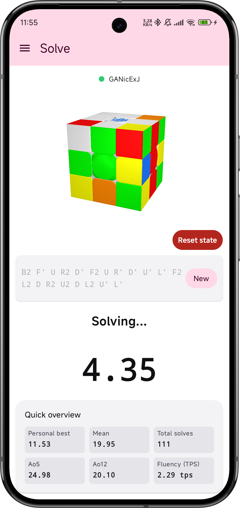
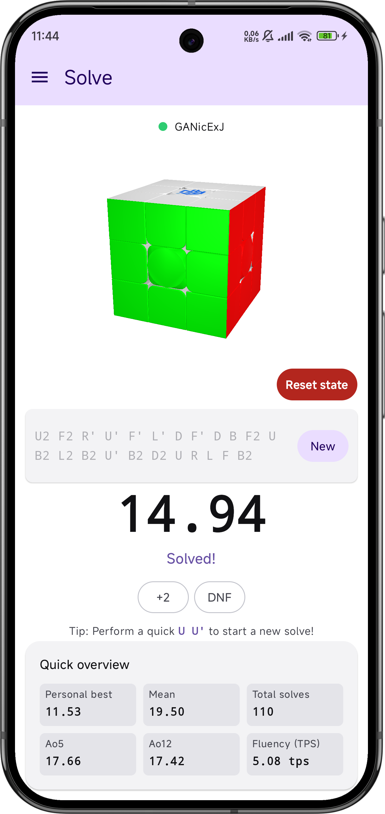
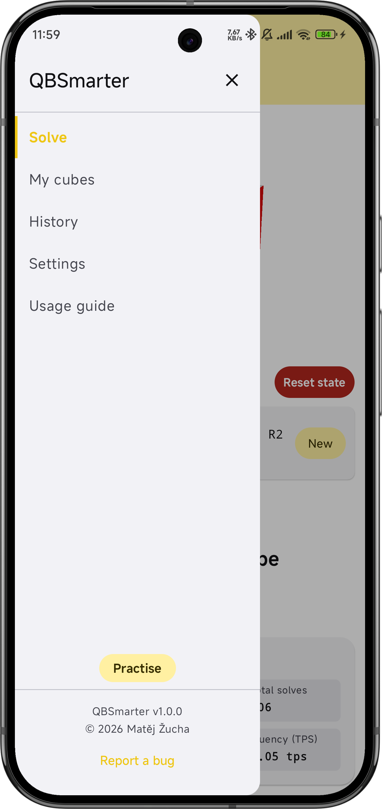
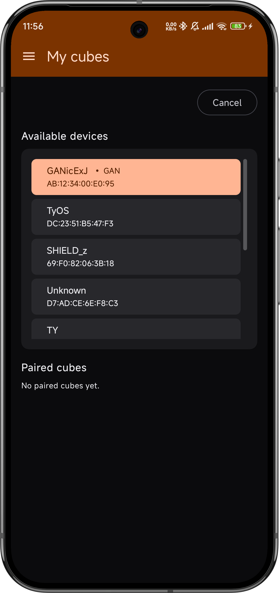
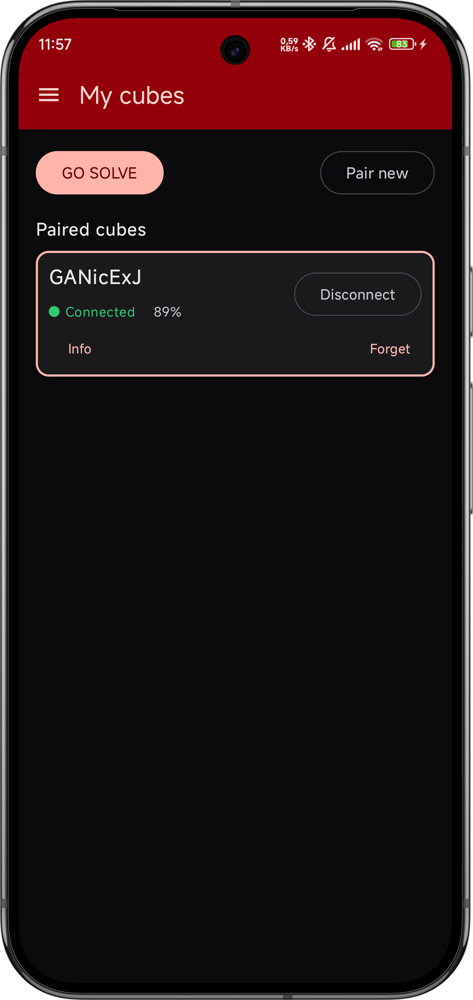
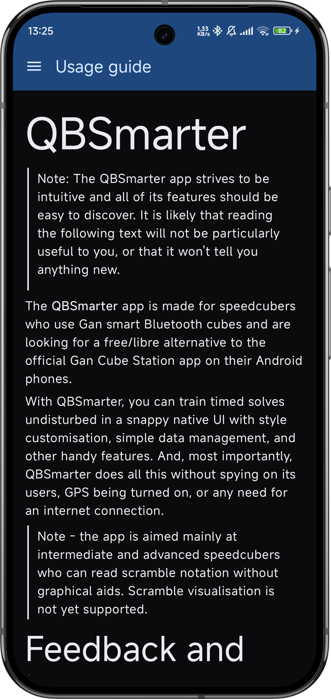

# QBSmarter screenshots

Here are some more screenshots of the QBSmarter app. You can see all the color variants
as well as the differences between dark mode and light mode.

[Go back to README](../../README.md).

---

## Solve screen: Scrambling phase

  

The Solve screen at the start of a session: a fresh scramble is generated and
displayed both as standard cube notation and as a live 3D preview. As you apply moves on the
physical cube, the preview updates in real time and indicates progress along
the scramble &ndash; it also indicates any wrong moves you did that deviate from the scramble,
and immediately gives you the moves to return to the correct scramble path.

---

## Solve screen: Solving phase

  

Once the scramble is fully applied, the timer starts (after the optional 15-second
inspection countdown). The 3D cube view continues mirroring the physical cube
through the solve so you can see exactly what the cube reports. You can stop the solve by pressing
the Reset state button as well.

---

## Solve screen: Solving finished

  

When the cube reaches the solved state, the timer stops and the post-solve
summary appears: final time, Ao5 snapshot, fluency (turns per second), and a
quick row of action buttons for **+2**, **DNF**, and starting the next solve.
A personal-best celebration is shown when the new effective time strictly beats
the previous best for the active profile. There is a quality of life feature to start a new solve
simply by performing a quick `U U'` move sequence.

>Note: this quick back-and-forth move sequence is detected regardless of the face it is perfomed on &ndash;
>this feature exists to ease up the whole process, with as minimal friction with your muscle memory as possible. 

---

## Sidebar navigation

  

The navigation drawer lists all five screens: Solve, Devices, History, Settings,
and Guide. The active screen is highlighted; switching screens preserves
per-screen state via the underlying NavHost's save/restore mechanism. That means you can press
the Back button or perform the system Back gesture to get to the Solve screen quickly from anywhere.

---

## Settings screen

  

The Settings screen handles profile management (create / rename / switch /
delete / per-profile JSON import and export), language selection (English and
Czech), and the inspection / keep-screen-on toggles.
You can also choose from eight hand-picked color seeds (Blue, Green, Purple, Orange, Red, Pink, Yellow,
Mono) combined with light and dark theme modes to give you 16 total palettes. The app respects your
system's configured theme mode by default.

---

## History screen

  

Every completed solve is persisted to a per-profile SQLite database entry and listed
on the History screen. The list is paged for performance, sortable by
newest / oldest / best / worst, and supports swipe-to-delete with confirmation.
Tapping a row opens a detail dialog with the date, scramble, fluency, and turn
count for that solve.

---

## My cubes screen: New cube pairing

  

The My cubes screen upon first launch. Tap **Pair** to scan for nearby smart cubes.
GAN cubes (identified by their MAC OUI prefix) are sorted to the top of the
results so the cube you actually want to connect to is the one drawing the eye.

---

## My cubes screen: Device management

  

Once paired, a cube appears in the **Paired cubes** section with its battery
level, hardware/software version (via the Info button), and per-cube actions
for Disconnect and Forget. The active cube gets a colored border and a green
indicator dot, which helps when you have multiple devices paired. Only one device
may be connected at once.

---

## Usage guide screen

  

The Guide screen renders a bundled Markdown file localized to the current
language. It explains every screen, every setting, and includes the contact
information for reporting bugs or suggesting features. It should be enough to
serve any new user with all the useful information.
